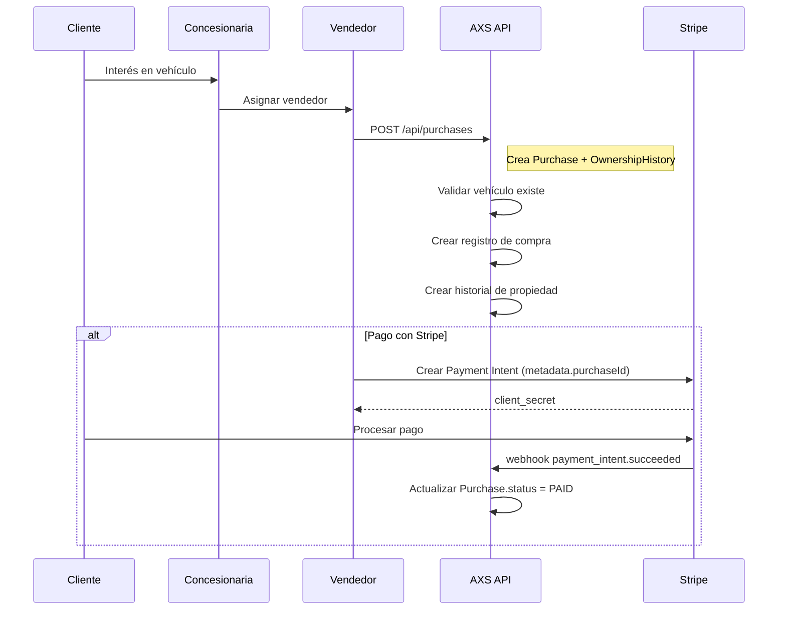
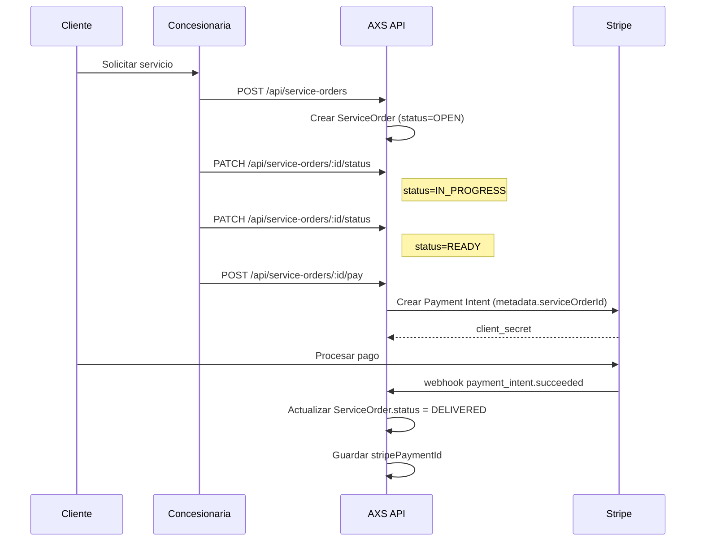

# Sistema de Trazabilidad para Concesionarias de Vehículos

## Diagrama de Entidad-Relación (ER)

```
┌─────────────────┐     ┌─────────────────┐     ┌─────────────────┐
│   Dealership    │────▶│   Salesperson   │────▶│    Purchase     │
│                 │     │                 │     │                 │
│ - id (PK)       │     │ - id (PK)       │     │ - id (PK)       │
│ - code (UQ)     │     │ - dealershipId  │     │ - vehicleId     │
│ - name          │     │ - name          │     │ - customerId    │
│ - address       │     │ - email (UQ)    │     │ - dealershipId  │
│ - city          │     │ - phone         │     │ - salespersonId │
│ - state         │     │ - active        │     │ - purchaseDate  │
│ - phone         │     │ - hiredAt       │     │ - price         │
│ - email         │     │                 │     │ - currency      │
└─────────────────┘     └─────────────────┘     │ - paymentMethod │
                                               │ - status        │
┌─────────────────┐     ┌─────────────────┐     │ - stripePaymentId│
│     Customer    │────▶│ OwnershipHistory│     │ - metadata      │
│                 │     │                 │     └─────────────────┘
│ - id (PK)       │     │ - id (PK)       │              │
│ - type          │     │ - vehicleId     │              │
│ - name          │     │ - customerId    │              ▼
│ - email (UQ)    │     │ - from          │     ┌─────────────────┐
│ - phone (UQ)    │     │ - to            │     │     Vehicle     │
│ - taxId         │     │ - note          │     │                 │
│ - address       │     └─────────────────┘     │ - id (PK)       │
└─────────────────┘                           │ - userId        │
        │                                    │ - vin (UQ)      │
        │                                    │ - plateNumber(UQ)│
        ▼                                    │ - brand         │
┌─────────────────┐                           │ - model         │
│  ServiceOrder   │                           │ - year          │
│                 │                           │ - color         │
│ - id (PK)       │                           └─────────────────┘
│ - orderNumber(UQ)│
│ - dealershipId  │
│ - vehicleId     │
│ - customerId    │
│ - openedAt      │
│ - closedAt      │
│ - status        │
│ - work (JSON)   │
│ - amount        │
│ - currency      │
│ - stripePaymentId│
│ - metadata      │
└─────────────────┘
```

## Enums del Sistema

```prisma
enum CustomerType {
  INDIVIDUAL  // Persona física
  COMPANY     // Empresa
}

enum PurchaseStatus {
  INITIATED   // Proceso iniciado
  PAID        // Pagado
  DELIVERED   // Entregado
  CANCELED    // Cancelado
}

enum ServiceOrderStatus {
  OPEN        // Abierta
  IN_PROGRESS // En progreso
  READY       // Lista
  DELIVERED   // Entregada
  CANCELED    // Cancelada
}

enum PaymentMethod {
  CARD        // Tarjeta
  TRANSFER    // Transferencia
  CASH        // Efectivo
  FINANCING   // Financiamiento
}
```

## Flujo Principal: Compra → Historial de Propiedad → Orden de Servicio → Pago con Stripe

### 1. Flujo de Compra de Vehículo



### 2. Flujo de Orden de Servicio



## Ejemplos de Requests/Responses

### 1. Crear Concesionaria

```bash
curl -X POST http://localhost:3001/api/dealerships \
  -H "Content-Type: application/json" \
  -H "Authorization: Bearer YOUR_JWT_TOKEN" \
  -d '{
    "code": "TOYOTA_MIA_001",
    "name": "Toyota Downtown Miami",
    "address": "123 Biscayne Blvd",
    "city": "Miami",
    "state": "FL",
    "phone": "+1-305-555-0123",
    "email": "contact@toyotamiami.com"
  }'
```

**Response:**
```json
{
  "id": "cm4xyz123",
  "code": "TOYOTA_MIA_001", 
  "name": "Toyota Downtown Miami",
  "address": "123 Biscayne Blvd",
  "city": "Miami",
  "state": "FL",
  "phone": "+1-305-555-0123",
  "email": "contact@toyotamiami.com",
  "createdAt": "2024-01-15T10:00:00Z",
  "updatedAt": "2024-01-15T10:00:00Z",
  "salespeople": [],
  "purchases": [],
  "serviceOrders": []
}
```

### 2. Crear Cliente

```bash
curl -X POST http://localhost:3001/api/customers \
  -H "Content-Type: application/json" \
  -H "Authorization: Bearer YOUR_JWT_TOKEN" \
  -d '{
    "type": "INDIVIDUAL",
    "name": "Juan Pérez",
    "email": "juan.perez@email.com",
    "phone": "+52-555-123-4567",
    "taxId": "CURP123456789",
    "address": "Av. Reforma 123, CDMX"
  }'
```

### 3. Crear Compra de Vehículo (con Historial de Propiedad automático)

```bash
curl -X POST http://localhost:3001/api/vehicles/vehicle-id-123/purchases \
  -H "Content-Type: application/json" \
  -H "Authorization: Bearer YOUR_JWT_TOKEN" \
  -d '{
    "dealershipId": "cm4xyz123",
    "customerId": "customer-id-456",
    "salespersonId": "salesperson-id-789",
    "price": 350000.00,
    "currency": "mxn",
    "paymentMethod": "FINANCING",
    "status": "INITIATED"
  }'
```

**Response:** 
```json
{
  "id": "purchase-id-abc",
  "vehicleId": "vehicle-id-123",
  "dealershipId": "cm4xyz123",
  "customerId": "customer-id-456",
  "salespersonId": "salesperson-id-789",
  "purchaseDate": "2024-01-15T10:00:00Z",
  "price": 350000.00,
  "currency": "mxn",
  "paymentMethod": "FINANCING",
  "status": "INITIATED",
  "vehicle": { "vin": "VIN123...", "brand": "Toyota", "model": "Camry" },
  "customer": { "name": "Juan Pérez", "email": "juan.perez@email.com" },
  "dealership": { "name": "Toyota Downtown Miami", "code": "TOYOTA_MIA_001" }
}
```

### 4. Ver Historial Completo de Propiedad de Vehículo

```bash
curl -X GET http://localhost:3001/api/vehicles/vehicle-id-123/ownerships \
  -H "Authorization: Bearer YOUR_JWT_TOKEN"
```

**Response:**
```json
[
  {
    "id": "ownership-id-1",
    "vehicleId": "vehicle-id-123",
    "customerId": "customer-id-456",
    "from": "2024-01-15T10:00:00Z",
    "to": null,
    "note": "Purchase ownership",
    "customer": {
      "name": "Juan Pérez",
      "email": "juan.perez@email.com"
    }
  }
]
```

### 5. Crear Orden de Servicio

```bash
curl -X POST http://localhost:3001/api/service-orders \
  -H "Content-Type: application/json" \
  -H "Authorization: Bearer YOUR_JWT_TOKEN" \
  -d '{
    "orderNumber": "SO-2024-001",
    "dealershipId": "cm4xyz123",
    "vehicleId": "vehicle-id-123", 
    "customerId": "customer-id-456",
    "status": "OPEN",
    "work": {
      "services": ["Oil change", "Filter replacement"],
      "estimatedHours": 2
    },
    "amount": 150.00,
    "currency": "mxn"
  }'
```

### 6. Procesar Pago de Orden de Servicio con Stripe

```bash
curl -X POST http://localhost:3001/api/service-orders/service-order-id/pay \
  -H "Content-Type: application/json" \
  -H "Authorization: Bearer YOUR_JWT_TOKEN" \
  -d '{
    "amount": 150.00,
    "currency": "mxn",
    "description": "Oil change service"
  }'
```

**Response:**
```json
{
  "id": "pi_1234567890abcdef",
  "client_secret": "pi_1234567890abcdef_secret_xyz",
  "amount": 15000,
  "currency": "mxn"
}
```

### PowerShell Examples

#### Crear Concesionaria (PowerShell)
```powershell
$headers = @{
    "Content-Type" = "application/json"
    "Authorization" = "Bearer YOUR_JWT_TOKEN"
}

$body = @{
    code = "TOYOTA_MIA_001"
    name = "Toyota Downtown Miami"
    address = "123 Biscayne Blvd"
    city = "Miami"
    state = "FL"
    phone = "+1-305-555-0123"
    email = "contact@toyotamiami.com"
} | ConvertTo-Json

Invoke-RestMethod -Uri "http://localhost:3001/api/dealerships" -Method POST -Headers $headers -Body $body
```

#### Probar Webhook de Stripe (PowerShell)
```powershell
$webhookBody = @{
    type = "payment_intent.succeeded"
    data = @{
        object = @{
            id = "pi_test_12345"
            amount = 15000
            currency = "mxn"
            metadata = @{
                serviceOrderId = "service-order-id-123"
                vehicleVin = "VIN123456789"
                dealershipId = "cm4xyz123"
                customerId = "customer-id-456"
            }
        }
    }
} | ConvertTo-Json -Depth 5

Invoke-RestMethod -Uri "http://localhost:3001/api/webhooks/stripe" -Method POST -Body $webhookBody -ContentType "application/json"
```

## Estrategias de Testing

### 1. Testing de Unidad
- **Servicios**: Mocking de PrismaService para cada CRUD operation
- **Controladores**: Testing de validación de DTOs y manejo de errores
- **Webhooks**: Testing de lógica de procesamiento con diferentes metadata

### 2. Testing de Integración  
- **Base de datos**: Testing con base de datos en memoria (SQLite)
- **Stripe**: Testing con Stripe Test Mode y webhooks simulados
- **API E2E**: Testing de flujos completos de compra y servicio

### 3. Happy Path Examples
```typescript
// Test: Crear compra y verificar historial de propiedad
it('should create purchase and ownership history', async () => {
  const purchase = await purchaseService.create(createPurchaseDto);
  const ownerships = await purchaseService.getOwnershipHistory(vehicleId);
  
  expect(purchase.status).toBe('INITIATED');
  expect(ownerships).toHaveLength(1);
  expect(ownerships[0].customerId).toBe(createPurchaseDto.customerId);
});

// Test: Webhook actualiza orden de servicio
it('should update service order on payment success', async () => {
  const paymentIntent = {
    id: 'pi_test_123',
    metadata: { serviceOrderId: 'so_123' }
  };
  
  await webhookController.handleServiceOrderPayment(paymentIntent, 'so_123');
  
  const serviceOrder = await serviceOrderService.findOne('so_123');
  expect(serviceOrder.status).toBe('READY');
  expect(serviceOrder.stripePaymentId).toBe('pi_test_123');
});
```

## Rendimiento y Seguridad

### Optimización de Rendimiento
- **Índices**: Añadidos en `vehicleId`, `dealershipId`, `customerId` para queries rápidas
- **Paginación**: Implementada en todos los listados (default 20 items)
- **Includes selectivos**: Solo cargar relaciones necesarias en cada endpoint
- **Transacciones**: Uso de `$transaction` para operaciones atómicas (compra + propiedad)

### Seguridad
- **Autenticación**: JWT tokens requeridos en todos los endpoints
- **Validación**: DTOs con `class-validator` para input validation
- **Unique constraints**: Códigos de concesionaria, números de orden únicos
- **Metadata encryption**: Datos sensibles en `metadata` JSON pueden ser encriptados
- **Stripe webhooks**: Verificación de signature en producción

### Monitoreo
- **Logs estructurados**: Winston logger con correlation IDs
- **Métricas**: Tracking de conversión de purchases y service orders
- **Alertas**: Monitoring de fallos en webhooks de Stripe
- **Auditoría**: Registro de cambios importantes en AuditLog

---

**Próximos pasos de implementación:**
1. Ejecutar migración de Prisma: `npm run prisma:migrate`
2. Generar cliente: `npm run prisma:generate` 
3. Iniciar backend: `npm run dev`
4. Configurar Stripe CLI: `npm run stripe:listen:3001`
5. Probar endpoints con Postman/curl usando ejemplos de arriba